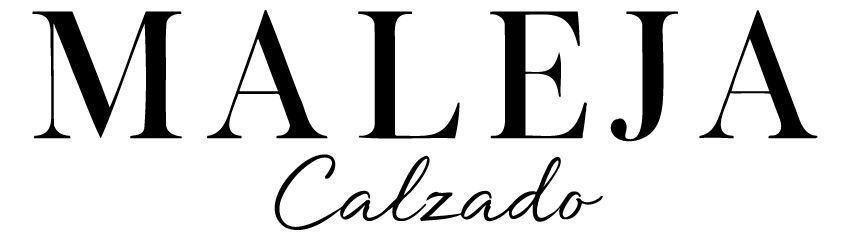
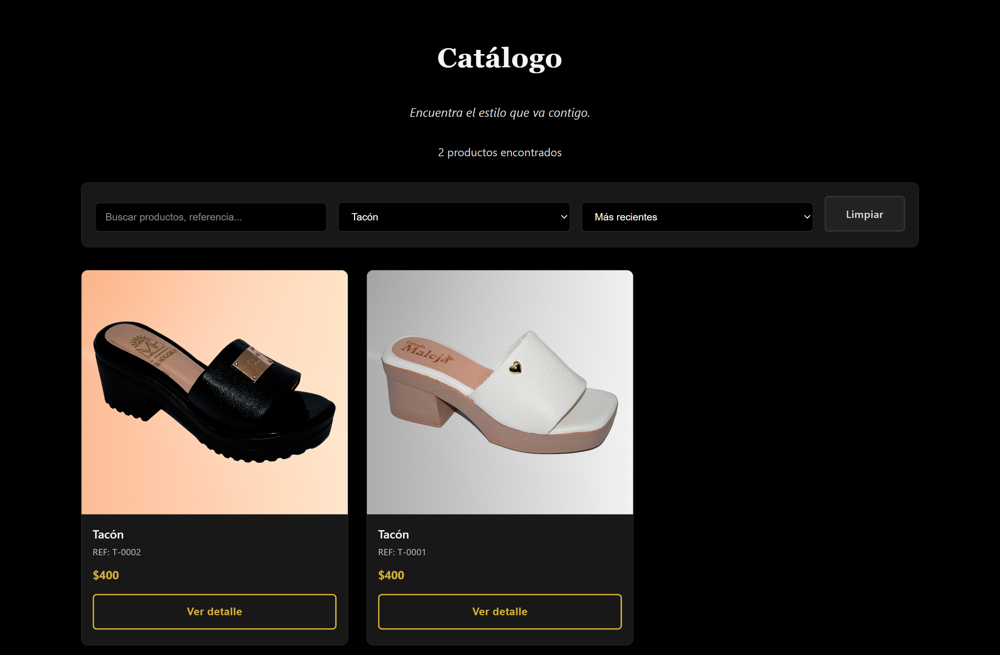
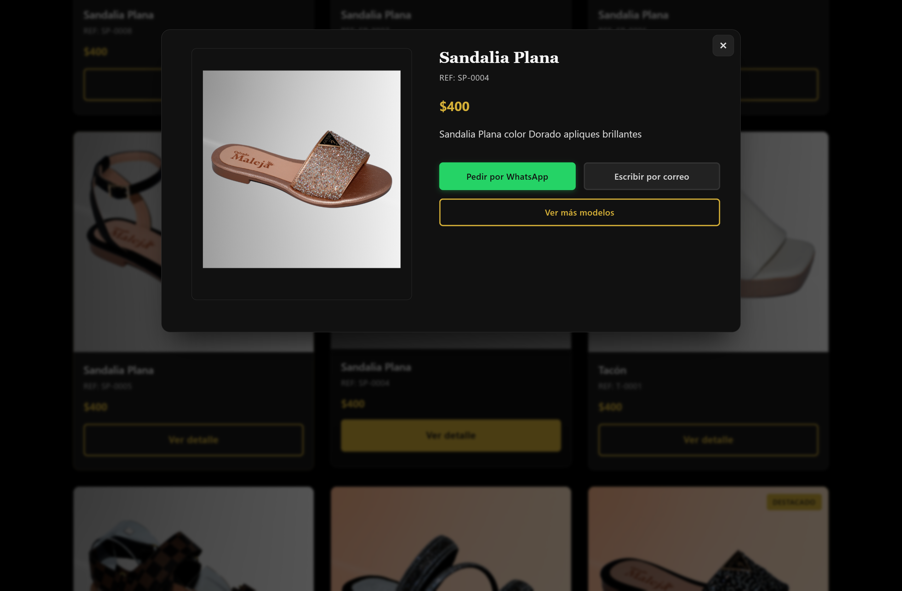
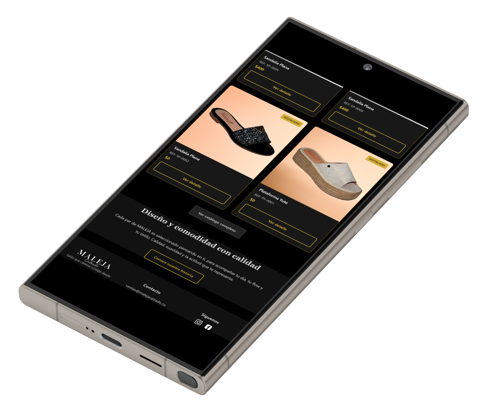
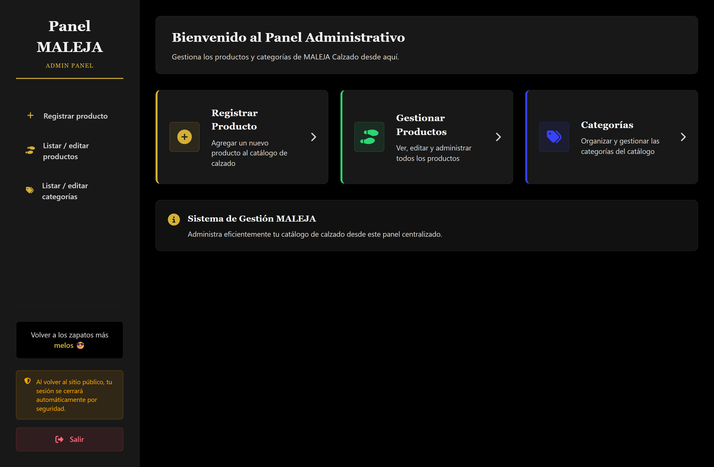

# MALEJA Calzado - Producto Mínimo Viable (PMV)




## 📋 Información del Proyecto

**Programa:** Tecnología en Análisis y Desarrollo de Software (ADSO) • SENA  
**Centro:** CGMLTI  
**Ubicación:** Cali, Valle del Cauca  
**Estado:**   
**Tipo:** 

---

## 🚀 Descripción del Emprendimiento

### ¿En qué consiste MALEJA Calzado?

**MALEJA Calzado** es un emprendimiento familiar especializado en calzado femenino que opera principalmente a través de WhatsApp e Instagram. 

#### Problemática Identificada
- Catálogos desordenados
- Respuestas lentas a consultas
- Falta de presencia web profesional
- Pérdida de ventas por fricción en el proceso

#### Solución Implementada
Plataforma web de catálogo integrada con WhatsApp Business que convierte la navegación en contactos directos con mensajes prellenados, reduciendo la fricción entre el interés del cliente y el contacto con el vendedor.


*Tarjeta de presentación real con códigos QR funcionales*

---

## 🎯 Producto Estrella: Catálogo Web + WhatsApp

### Funcionalidades Core

| Característica | Descripción |
|----------------|-------------|
| **Catálogo Responsive** | Navegación fluida con filtros, búsqueda y paginación |
| **Ficha de Producto** | Galería de imágenes y botón WhatsApp directo |
| **Panel Administrativo** | CRUD completo para autogestión |
| **Integración WhatsApp** | Mensajes prellenados por producto |

### Diferenciadores Clave

- ✅ **Enfoque Local**: Orientado a microempresas de Cali
- ✅ **Conversión Directa**: No e-commerce tradicional, sino puente a WhatsApp
- ✅ **Optimización Móvil**: Velocidad y usabilidad móvil prioritaria
- ✅ **Soporte Incluido**: Capacitación y acompañamiento


*Diseño responsive adaptable a móvil y desktop*

---

## 🛠️ Implementación Técnica

### Stack Tecnológico

```
Backend:  PHP 8 + MySQL
Frontend: JavaScript Vanilla + CSS Grid
Security: SSL + Password Hash + Sanitización
Performance: Lazy Loading + Optimización de imágenes
```

### Arquitectura del Sistema

#### Estructura de Desarrollo
- **Patrón MVC Adaptado**: Separación clara de responsabilidades
- **Autenticación Segura**: Sistema de login para panel administrativo
- **Diseño Mobile-First**: Desarrollo prioritario para dispositivos móviles
- **SEO y Accesibilidad**: Implementación de buenas prácticas (alt, aria-label)

#### Infraestructura
- **Hosting**: Hostinger con dominio propio
- **Seguridad**: SSL, variables de entorno, PDO preparado
- **Performance**: Imágenes ≤ 200KB, carga optimizada


*Diagrama de arquitectura del sistema*

---

## 📈 Metodología de Desarrollo ADSO

### Proceso en 8 Fases

1. **Levantamiento de Requisitos** - Análisis con MALEJA
2. **Diseño UX/UI** - Enfoque mobile-first
3. **Setup Técnico** - Configuración de dominio, hosting, SSL y BD
4. **Desarrollo Iterativo** - Catálogo → Admin → WhatsApp
5. **Pruebas Funcionales** - Testing de usabilidad
6. **Carga de Contenido** - Productos iniciales
7. **Despliegue** - Producción + capacitación
8. **Medición y Ajustes** - Optimización basada en métricas


*Metodología iterativa con validación continua y mejora basada en métricas*

---

## 🖥️ Prototipo Funcional

### Capturas del Sistema Implementado

#### Frontend - Experiencia del Usuario


*Homepage - Vista principal con navegación limpia y acceso directo al catálogo*


*Catálogo de productos - Filtros por categoría, talla y precio con búsqueda en tiempo real*


*Modal de detalle - Galería, info completa y botón WhatsApp*


*Responsive móvil - Optimización para dispositivos móviles*

#### Backend - Panel Administrativo


*Panel administrativo - CRUD de productos con interfaz limpia*

### Características Implementadas

#### Frontend - Experiencia del Usuario
- **Homepage**: Vista principal con navegación intuitiva
- **Catálogo**: Filtros por categoría, talla y precio con búsqueda en tiempo real
- **Modal de Producto**: Galería completa, información detallada y botón WhatsApp
- **Responsive**: Optimización completa para móviles

#### Backend - Panel Administrativo
- **CRUD de Productos**: Gestión completa del inventario
- **Interfaz Limpia**: Dashboard intuitivo para el cliente
- **Seguridad**: Autenticación y protección de datos

---

## 🌐 Demo en Vivo

### Enlaces Funcionales

- **Sitio Web Principal**: [malejacalzado.com](https://malejacalzado.com)
- **Panel de Administración**: [malejacalzado.com/admin/login.php](https://malejacalzado.com/admin/login.php)

---

## ✅ Validación y Métricas

### Rendimiento Actual

| Métrica | Resultado | Estado |
|---------|-----------|---------|
| **Funcionalidades Core** | 100% Implementadas | ✅ Completado |
| **Tiempo de Carga** | < 2 segundos | ✅ Óptimo |
| **Seguridad** | SSL + A11y | ✅ Validado |
| **Responsive** | Mobile Ready | ✅ Funcional |
| **Integración WhatsApp** | Operativa | ✅ Activa |

### Próximas Métricas a Medir

- 📊 **CTR a WhatsApp** desde productos
- 📱 **Analítica de uso móvil**
- 💬 **Feedback directo** de MALEJA
- 🔄 **Iteraciones** basadas en datos reales

---

## 💰 Modelo de Negocio PMV

### Inversión Real del PMV

| Concepto | Costo |
|----------|-------|
| **Dominio + Hosting** | $80.000/año |
| **Desarrollo** | $120.000 |
| **Tiempo Invertido** | 60 horas |
| **🎯 Total PMV** | **$200.000** |

### Proyección Post-Validación

- **Servicios Similares**: $800k - $2M
- **Tiempo de Implementación**: 3-6 semanas
- **ROI Proyectado**: 300-500%
- **Market Fit**: Microempresas Valle del Cauca

---

## 💬 Innovación: WhatsApp-Commerce

### Flujo de Conversión Optimizado

```
1. Usuario navega catálogo web
    ↓
2. Selecciona producto de interés
    ↓
3. Click "Consultar por WhatsApp"
    ↓
4. Abre WhatsApp con mensaje prellenado
    ↓
5. Conversación directa con vendedor
    ↓
6. Cierre de venta personalizado
```

**Resultado**: Conversión directa de navegación web a chat personal en 1 click, eliminando fricciones del proceso tradicional.

---

## 🗺️ Roadmap de Evolución

### ✅ Fase 1: PMV (Completado)
- Catálogo web funcional
- Panel administrativo
- Integración WhatsApp
- Hosting y dominio

### 🔄 Fase 2: Validación y Expansión
- Sistema de pagos online
- Carrito de compras
- Gestión de inventario
- Analítica avanzada

### 🚀 Fase 3: Escalamiento
- Marketplace multi-vendor
- App móvil nativa
- IA para recomendaciones
- Expansión regional

---

## 📊 Conclusiones del PMV

### ✅ Validación Inicial Exitosa

- **PMV Funcional**: Completamente desplegado y operativo
- **Competencias ADSO**: Aplicadas integralmente
- **Cliente Real**: Necesidad validada con MALEJA
- **Tecnología Estable**: Stack probado y confiable

### 🎯 Aprendizajes Clave

| Aprendizaje | Descripción |
|-------------|-------------|
| **Enfoque Específico** | Soluciones personalizadas > genéricas |
| **Mobile-First** | Crítico para el éxito del proyecto |
| **WhatsApp como Puente** | Herramienta efectiva de conversión |
| **Métricas Reales** | Datos concretos > especulación |

### 🔄 Próximo Paso Crítico

**Medir conversión real** con usuarios de MALEJA durante 30 días para validar hipótesis de negocio y decidir escalamiento.

---

## 📞 Información de Contacto

**Desarrollador:** William Pérez  
**Cliente:** MALEJA Calzado  
**Programa:** Tecnología ADSO  
**Centro:** CGMLTI - SENA  
**Ubicación:** Cali, Valle del Cauca  

### Enlaces de Referencia
- **PMV en Vivo**: [Ver Sitio Web](https://malejacalzado.com)
- **Contacto**: [Panel Admin](https://malejacalzado.com/admin/login.php)

---

*Documento generado para el Producto Mínimo Viable de MALEJA Calzado - Tecnología ADSO • SENA*